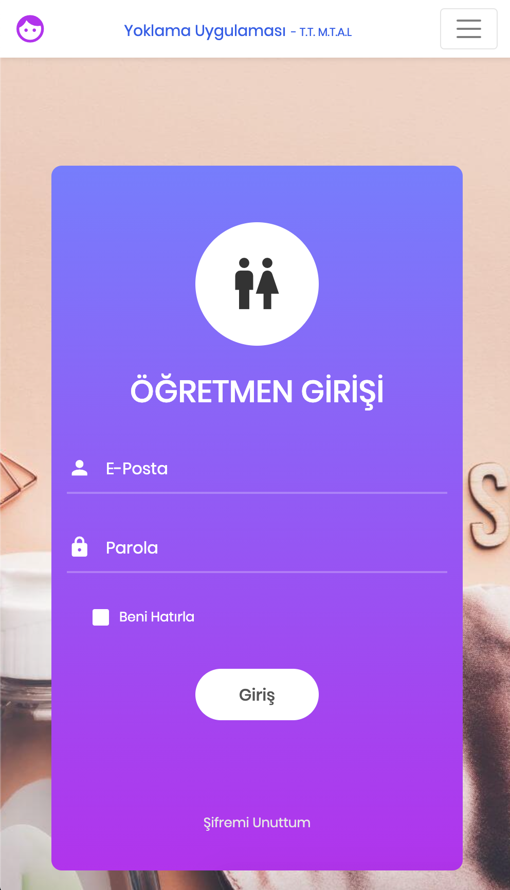
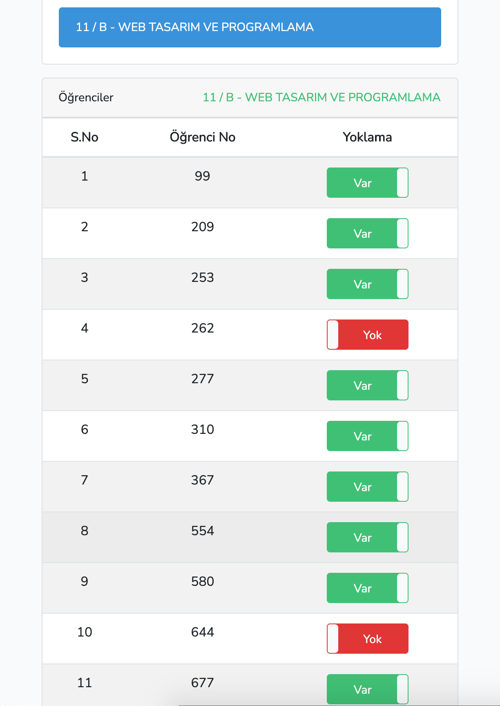
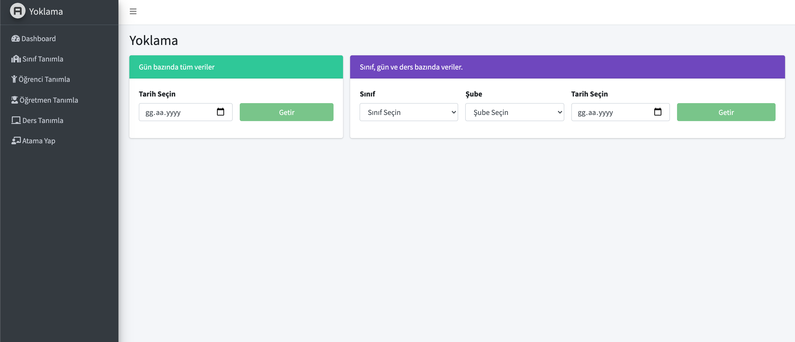

## TR

## Uygulama Hakkında
Bu uygulama Covid-19 pandemi sürecinde sürdürülen uzaktan eğitim faaliyetlerinde öğrencilerin yoklamalarının alınması problemine çözüm üretmek için geliştirilmiştir. Uygulama [Laravel 8.11.2 Sürümü](https://laravel.com/) ile geliştirilmiştir. Projede kullanılan diğer JS kütüphaneleri ayrıca aşağıda listelenmiştir.  

Yönetim panelinde [laravel admin lte](https://github.com/jeroennoten/Laravel-AdminLTE) teması kullanılmıştır. 

## Kullanımı
Uygulamayı git üzerinden klonlayın ardından database migration işlemlerini yapın ve sonra kullanmaya başlayabilirsiniz. Tabi ki bir veritabanınızın olması ve bu veritabanı erişim bilgilerinin '.env' dosyasında gerekli alanlara yazılmış olması gereklidir. 

Migration (php artisan migrate) işlemini yaparak veritabanı tablolarını oluşturun,  

Sonrasında, 

php artisan db:seed --class=UserSeeder  
php artisan db:seed --class=ClassSeeder  

komutları ile users ve classes tablolarına örnek veriyi basın.  

bunun ardından bir adet yönetici seviyesinde kullanıcı eklenecek bilgileri şu şekilde:    

E-Mail: user@test.com  
Password: 12345678  

Son olarak, 
php artisan key:generate   

Daha sonra kullanıcı ekleme silme işlemlerini yönetim panelinden yapabilirsiniz.

Uygulamayı yerelde çalıştırdıktan sonra hosting / sunucu üzerine göndererek deploy edebilirsiniz. 
[iletişim](mailto:ascanipek@gmail.com)

## Kullanılan Diğer Kütüphaneler
- **[Bootstrap](https://getbootstrap.com/)**
- **[jQuery](https://github.com/jquery/jquery)**
- **[SweetAlert2](https://github.com/sweetalert2/sweetalert2)**
- **[Login Form v3 by Colorlib](https://colorlib.com/wp/template/login-form-v3/)**
- **[BootstrapToggle](https://www.bootstraptoggle.com/)**

## Dağıtım

Projeye geliştirme amaçlı katkı verirseniz çok memnun olurum.

## Güvenlik Açıkları

Bir güvenlik açığı keşfederseniz, lütfen iletişimde bulunan e-posta aracılığıyla bir e-posta gönderin.

## Lisans

Bu proje MIT altında lisanslanan açık kaynaklı bir yazılımdır: [MIT lisansı](https://opensource.org/licenses/MIT)..

## Uygulama Görselleri

  

## EN

## About

This application has been developed to solve the problem of taking the attendance of students in the distance education activities carried out during the Covid-19 pandemic process. The application has been developed with [Laravel 8.11.2 Version] (https://laravel.com/). Other JS libraries used in the project are also listed below.

The theme [laravel admin lte](https://github.com/jeroennoten/Laravel-AdminLTE) is used in the administration panel.

## Using

Clone the application via git, then do database migration and then you can start using it. Of course, you must have a database and this database access information must be written in the required fields in the '.env' file.

After running the application locally, you can deploy it by sending it on the hosting / server.  

After doing Migration (php artisan migrate).
And then, 

php artisan db:seed --class=UserSeeder  
php artisan db:seed --class=ClassSeeder  

a user with administrative authority will be added, the information of this user:  

E-Mail: user@test.com  
Password: 12345678  

Finally run, 
php artisan key:generate  

Later, you can add and delete users from the management panel.  

[Contact](mailto:ascanipek@gmail.com)

## Other Libraries or Frameworks 

- **[Bootstrap](https://getbootstrap.com/)**
- **[jQuery](https://github.com/jquery/jquery)**
- **[SweetAlert2](https://github.com/sweetalert2/sweetalert2)**
- **[Login Form v3 by Colorlib](https://colorlib.com/wp/template/login-form-v3/)**
- **[BootstrapToggle](https://www.bootstraptoggle.com/)**

## Contributing

I would be very glad if you contribute to the project for development purposes.

## Security Vulnerabilities

If you discover a security vulnerability, please send an email via the email in communication.

## License

This project is open source software licensed under MIT [MIT license](https://opensource.org/licenses/MIT).
